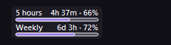
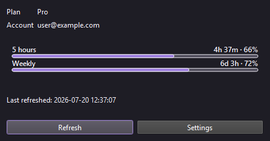
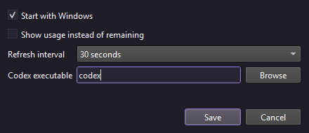

# Codex Usage Taskbar

[](https://github.com/chiconws/codex-usage-taskbar/actions/workflows/ci.yml)
[](https://github.com/chiconws/codex-usage-taskbar/releases)

A small Windows 11 taskbar widget that shows graphical Codex account usage bars.

By default, the filled portion represents remaining usage; Settings can switch it to used usage. The widget reads rate-limit metadata from the locally installed Codex CLI app-server and does not read `auth.json`, count tokens, display credits, or send telemetry.

The taskbar widget is intentionally compact: it uses two 128 px-wide rows, with 5 hours above Weekly. Each row includes its label, reset countdown before its percentage, and graphical bar. It is placed on the left side of the taskbar as a lightweight taskbar overlay; it can still be dragged along the taskbar, and its position is remembered. The Details window shows the same reset countdowns with the full-width wording when a reset time is unavailable. If Codex does not return a 5-hour limit, the app shows a neutral `No data` placeholder for that row rather than inventing usage values. Refreshes run without opening a command window.

The Details dialog shows live plan and account email information when the local Codex app-server exposes those fields, along with the existing reset countdowns. Banked reset data is intentionally unsupported and not displayed or inferred. The app displays no tokens, credits, or credentials.

In Settings, enable **Show usage instead of remaining** to switch from the default remaining percentage (100% depleting toward 0%) to used percentage (0% filling toward 100%).

The widget is a non-activating top-level window owned by the Windows taskbar. This is the same docking pattern used by taskbar-native utilities: Windows keeps the owned widget above the taskbar's modern XAML surface, while the app still uses a small normal Qt window for reliable painting and mouse input. It reattaches when the taskbar window is recreated, such as after an Explorer restart.

## Screenshots

These examples use synthetic account data and show the compact taskbar display, Details window, and Settings window.

### Compact taskbar display



### Details window



### Settings window



## Development

```powershell
python -m venv .venv
.\.venv\Scripts\python.exe -m pip install -e ".[dev]"
$env:QT_QPA_PLATFORM = "offscreen"
.\.venv\Scripts\python.exe -m pytest -q
```

Run from source:

```powershell
.\.venv\Scripts\python.exe -m codex_usage_taskbar.main
```

Codex CLI must be installed and logged in. The app reuses that local login through `account/rateLimits/read`.

## Install a release

Download the latest Windows zip from the [GitHub Releases page](https://github.com/chiconws/codex-usage-taskbar/releases), extract it, and run `CodexUsageTaskbar.exe`. No Python installation is required for the packaged build.

This project is distributed under the [MIT License](LICENSE). Contributions and bug reports are welcome; see [CONTRIBUTING.md](CONTRIBUTING.md) and [SECURITY.md](SECURITY.md).

## Packaging

```powershell
.\.venv\Scripts\python.exe -m pip install pyinstaller
.\build.ps1
```

`build.ps1` packages the import-safe `packaging_entry.py` wrapper, which calls the application entrypoint only when launched as a script. The portable build is written to `dist\CodexUsageTaskbar\CodexUsageTaskbar.exe`.

## Releases

Versions follow semantic versioning. The project version in `pyproject.toml` must match the tag without its leading `v`; for example, version `0.1.0` is released with tag `v0.1.0`. GitHub Actions builds and attaches the Windows zip when a matching tag is pushed.
